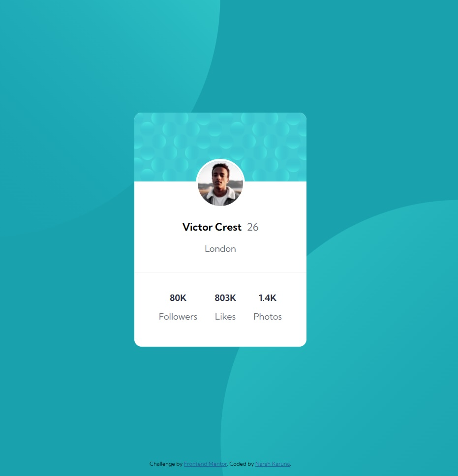

# Frontend Mentor - Profile card component solution

This is a solution to the [Profile card component challenge on Frontend Mentor](https://www.frontendmentor.io/challenges/profile-card-component-cfArpWshJ). Frontend Mentor challenges help you improve your coding skills by building realistic projects. 

## Table of contents

- [Overview](#overview)
  - [The challenge](#the-challenge)
  - [Screenshot](#screenshot)
  - [Links](#links)
- [My process](#my-process)
  - [Built with](#built-with)
- [Author](#author)

## Overview

### The challenge

- Build out the project to the designs provided

### Screenshot

### Links

- [Solution](https://github.com/narahkaruna/frontendmentor.io/tree/main/profile-card-component-main)
- [Live Site](https://gentle-alpaca-951001.netlify.app/)

## My process

### Built with

- HTML5
- CSS3
- Flexbox

## Author

- Frontend Mentor - [@Narah-Karuna](https://www.frontendmentor.io/profile/narahkaruna)

